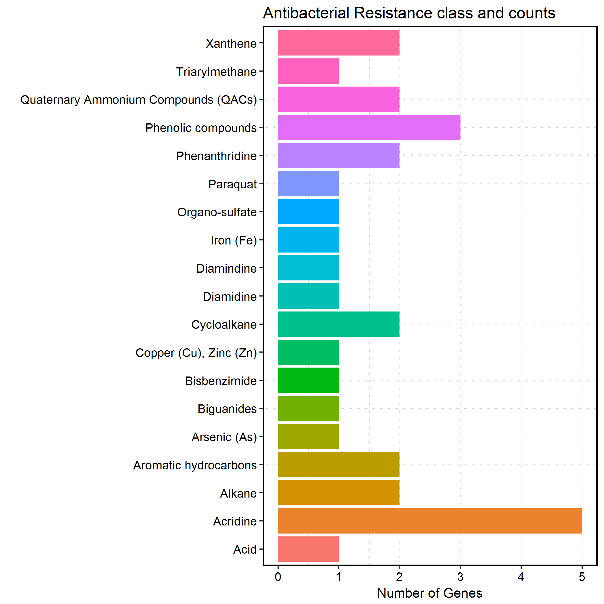

# BacMet

Seqs data of this repo and the BacMet-Scan_v1.1.pl forked from [BacMet](http://bacmet.biomedicine.gu.se) version 2, but I have modified it according to myself.

# Modify history

1) add function that can run **[diamond (v0.9.10)](https://github.com/bbuchfink/diamond)** search of BacMet-Scan_v1.1, that can run faster for blastp.

   when you run `perl ./BacMet-Scan_v1.1.pl -h`, you will find -diamond option, others no change, so that you can run it good for you.

   Also, I had provided a database of diamond v0.9.10 at BacMet2\_EXP, BacMet2\_EXP directory, you can use it directly without make database by diamond makedb.

2) make a new mapping.txt for BacMet v2 adjust to BacMet-Scan_v1.1.pl, because version 2  is different from v1.1 about BacMet. More see the mapping.txt.

3) fixed some bug of BacMet-Scan_v1.1.pl.

# Usage

```
# first, build the blast index file (important!)
makeblastdb -in BacMet2_PRE/BacMet_PRE_database.fasta -input_type fasta -dbtype prot

# for help
perl ./BacMet-Scan_v1.1.pl -h

# then you can see the help informations, like this
Usage: BacMet-Scan -i <input file> -o <output files base>
Options:
-i <input file> : the path to the input file containing non-paired sequences to scan
-1 <input file> : if using paired-end input, the path to the input file containing the first reads to scan
-2 <input file> : if using paired-end input, the path to the input file containing the second reads to scan
-o <output> : the base name of the BacMet-Scan output files (if not specified, BacMet-Scan will write to stdout)
-d <database> : the database to use, either EXP, PRE, or a path to a specific database directory, default 'PRE'

 Software options:
 =================
-blast : uses BLAST for searching BacMet (default)
-blastall : uses the old BLAST engine for searching BacMet
-blat : uses BLAT for searching BacMet
-pblat : uses Parallel BLAT (pblat) for searching BacMet
-vmatch : uses VMATCH for searching BacMet
-fixst : uses FIXST for searching BacMet
-diamond : uses diamond (v0.9.10) for searching BacMet

-cpu <value> : number of CPUs to use (if possible), default = 1
-r <file> : use this file (output from the tool above that generated the file)
            for input instead of performing the actual search
-protein : input sequence file is in protein format (nucleotides are assumed by default)

 Filtering options:
 =================
-e <value> : E-value cutoff, default = 1
-l <value> : Length cutoff, default = 30
-p <value> : Percent identity cutoff, default = 90
-s <value> : Score per length cutoff, not used by default (tool dependent!)
 Output options:
 =================
-table : outputs a BacMet-Scan report in table format (default)
-report : outputs the BLAST/BLAT/VMATCH/FIXST report
-counts : outputs a list of counts for each gene
-matrix : outputs a list of counts for each gene, without the gene names, suitable for matrix format
-toplist : outputs a list of encountered genes, sorted by abundance
-all : outputs all possible BacMet-Scan output
-columns : selects what columns to output to the BacMet-Scan output table
           comma-separated list with the following possible items:
           query,subject,gene,description,organism,location,compound,identity,length,evalue,score
           default is: query,subject,gene,identity,length
           can also be specified as 'all' to get all columns
-v : be verbose (print messages during the BacMet-Scan process)

-h : displays short usage information
-help : displays this help message
-bugs : displays the bug fixes and known bugs in this version
-license : displays licensing information
-----------------------------------------------------------------

# example
perl ./BacMet-Scan_v1.1.pl -i ecoli_protein.fa -o ecoli_bacmet -d ./BacMet2_PRE -diamond -protein -cpu 10 -e 1e-5 -p 80 -all -columns all

for more example, see test directory.
```

# Other tools

## 1. summary and barplot of bcamet out

See bacmet_class_summary.py and ar_class_barplot.R. Example,

```
# summary
python3 bacmet_class_summary.py ecoli_bacmet.table > bacmet_class_count.txt
# barplot
Rscript ar_class_barplot.R bacmet_class_count.txt bacmet_class_count
# will make bacmet_class_count.pdf and bacmet_class_count.png of BacMet barplot output (only top 50 to plot)
```

AR barplot can see test_args_bacmet_count.pdf(png) at ./test directory. Like this:



# License

Copyright (C) 2013-2014 Johan Bengtsson-Palme & Chandan Pal.

More see license file.
